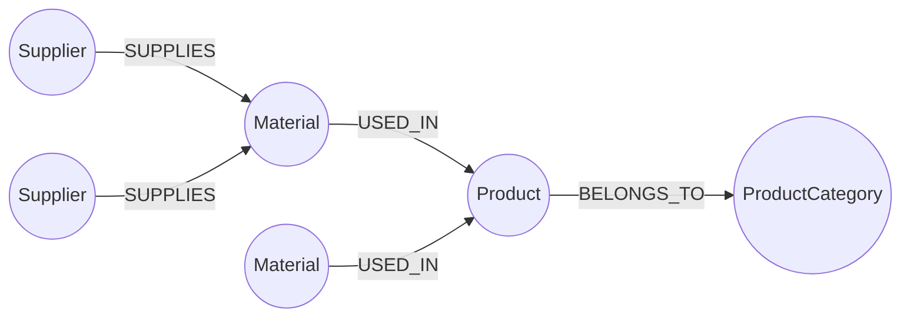
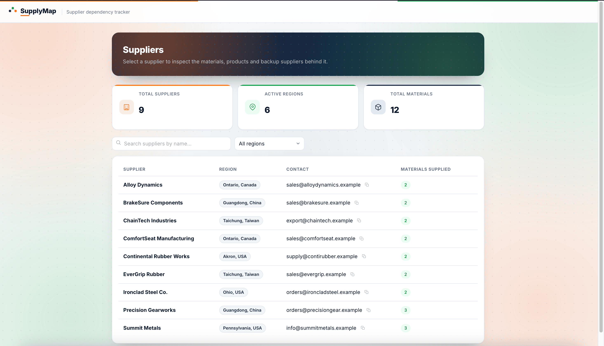
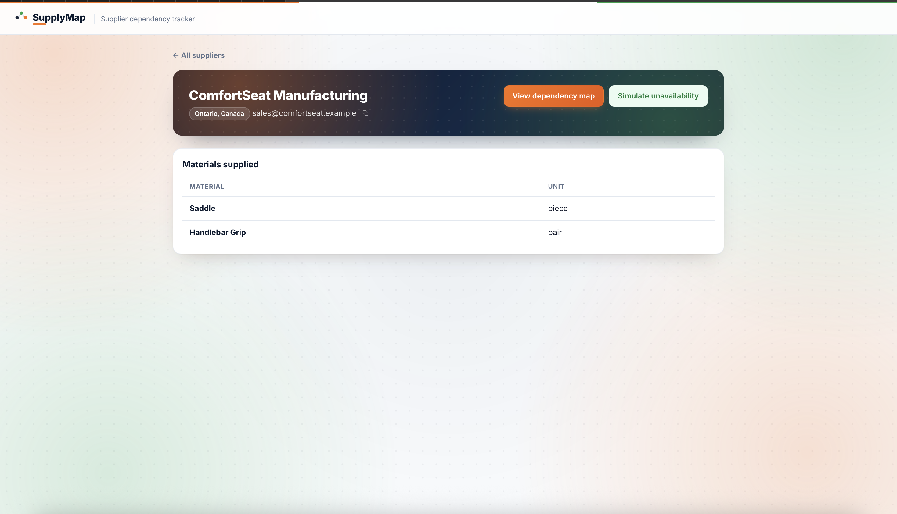
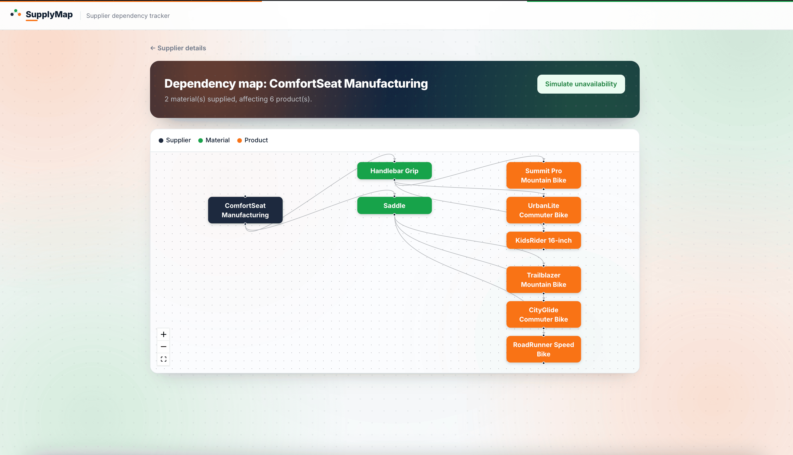
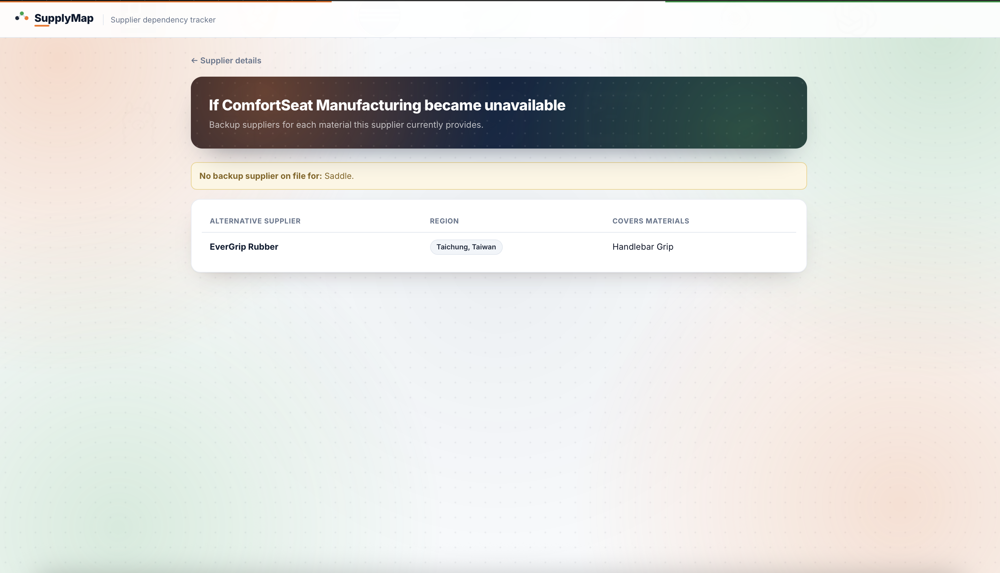

# SupplyMap

An internal tool for a small manufacturing business (a fictional bicycle
manufacturer) to answer one question quickly: **"If this supplier goes down,
what breaks, and who else can cover it?"**

Today that question gets answered by someone manually cross-referencing
spreadsheets. SupplyMap turns it into three clicks: pick a supplier, see what
it feeds, see who backs it up.

## The problem

The business buys raw materials (steel tubing, tires, brake pads, ...) from
multiple suppliers. Those materials go into multiple products. When a
supplier can't ship, staff need to know, in order:

1. Which materials does this supplier provide?
2. Which products use those materials, and are therefore at risk?
3. Which other suppliers already provide the same materials?

## Why a graph database?

Every one of those questions is a **traversal**, not a lookup: supplier →
material → product, or supplier → material ← alternate supplier. In a
relational schema this is a chain of joins across `suppliers`,
`supplier_materials`, `materials`, `material_products`, and `products` -
and the "find another supplier of the same material" query is a self-join
back through the same junction table. It works, but it's already awkward at
four entities, and it gets worse as more supplier tiers or substitute
materials are added.

In CognoDB (openCypher over Bolt), the same questions are direct pattern
matches:

```cypher
MATCH (s:Supplier {id: $id})-[:SUPPLIES]->(m:Material)-[:USED_IN]->(p:Product)
RETURN m, p
```

No junction tables, no join planning, and the query reads like the business
question it answers. The "alternative suppliers" query is the clearest case
for a graph: it's a path that leaves a node, crosses a shared material, and
comes back through a different supplier - a shape SQL expresses as a
self-join but Cypher expresses as one line: `(s)-[:SUPPLIES]->(m)<-[:SUPPLIES]-(alt)`.

## Core workflow

```
Dashboard → select supplier → view supplied materials → view affected products
          → simulate supplier unavailability → identify alternative suppliers
```

## Data model



**Nodes**

| Label             | Properties                       |
| ----------------- | --------------------------------- |
| `Supplier`        | `id`, `name`, `region`, `contactEmail` |
| `Material`        | `id`, `name`, `unit`              |
| `Product`         | `id`, `name`, `sku`               |
| `ProductCategory` | `id`, `name`                      |

**Relationships**

| Type         | Direction                       | Properties                    |
| ------------ | -------------------------------- | ------------------------------ |
| `SUPPLIES`   | `(Supplier)->(Material)`         | `leadTimeDays`, `unitCost`     |
| `USED_IN`    | `(Material)->(Product)`          | `quantityPerUnit`              |
| `BELONGS_TO` | `(Product)->(ProductCategory)`   | -                              |

**Constraints & indexes** (see [`backend/scripts/seed.js`](backend/scripts/seed.js)):

- Uniqueness constraint on `id` for every node label
- Index on `name` for `Supplier`, `Material`, `Product` (backs the search box)

## Project structure

```
SupplyMap/
  backend/            Express API + neo4j-driver
    src/
      config/db.js        one shared driver instance
      routes/              → controllers/              → services/   (Cypher lives here)
      middleware/          centralized error handling, async wrapper
    scripts/seed.js     constraints + realistic seed data
  frontend/           React (Vite) UI, 4 screens, React Flow for the dependency map
```

## Setup

### 1. Create a CognoDB instance

1. Sign up at [console.cognodb.com](https://console.cognodb.com/signup) (free, no card).
2. Create a free `c0` instance, pick a region, wait ~1 minute.
3. Copy the connection URI (`bolt+s://<instance-id>.databases.cognodb.cloud`) and the
   generated password for user `cognodb` - it's shown once.

### 2. Backend

```bash
cd backend
cp .env.example .env
# edit .env with your NEO4J_URI / NEO4J_USERNAME / NEO4J_PASSWORD
npm install
npm run seed    # applies constraints/indexes and loads sample data
npm run dev     # http://localhost:4000
```

### 3. Frontend

```bash
cd frontend
cp .env.example .env   # defaults to http://localhost:4000/api
npm install
npm run dev             # http://localhost:5174
```

Open `http://localhost:5174`.

## Deployment

Backend on [Render](https://render.com) (free web service), frontend on
[Vercel](https://vercel.com) (free static hosting). Deploy the backend first -
the frontend needs its URL.

### 1. Backend → Render

1. New → Blueprint, point it at this repo. Render reads [`render.yaml`](render.yaml)
   at the repo root and finds the service in `backend/` automatically.
   (No blueprint? New → Web Service instead, root directory `backend`, build
   command `npm install`, start command `npm start`.)
2. Set the environment variables Render prompts for (kept out of the repo by
   `sync: false` in `render.yaml`): `NEO4J_URI`, `NEO4J_USERNAME`,
   `NEO4J_PASSWORD` from your CognoDB instance, and `CORS_ORIGIN` - set it to
   `*` for now, you'll tighten it in step 3.
3. Deploy. Note the public URL, e.g. `https://supplymap-api.onrender.com`.
   Confirm it's alive: `curl https://supplymap-api.onrender.com/api/health`.

   Render's free tier spins down after 15 minutes idle - the first request
   after a while takes ~30-50s to wake up. That's an infra characteristic of
   the free tier, not a code issue (the app's own DB-unreachable handling is
   what you're seeing verified live in [Engineering notes](#engineering-notes)).

### 2. Frontend → Vercel

1. New Project, import this repo, set **Root Directory** to `frontend`.
   Vercel auto-detects Vite; [`vercel.json`](frontend/vercel.json) adds the
   SPA rewrite so deep links like `/suppliers/sup-001` don't 404 on refresh.
2. Add environment variable `VITE_API_URL` = `https://supplymap-api.onrender.com/api`
   (your Render URL + `/api`).
3. Deploy. Note the public URL, e.g. `https://supplymap.vercel.app`.

### 3. Close the loop

Back in Render, set `CORS_ORIGIN` to your exact Vercel URL (no trailing
slash) and redeploy. Without this the browser blocks the frontend's requests.

### 4. Seed the live database

Run the seed script from your machine, pointed at the same CognoDB instance
Render uses (your local `backend/.env`, not committed):

```bash
cd backend && npm run seed
```

## API

| Method | Path                              | Returns                                          |
| ------ | ---------------------------------- | ------------------------------------------------- |
| GET    | `/api/health`                      | DB connectivity status                             |
| GET    | `/api/suppliers`                   | All suppliers, with material counts                |
| GET    | `/api/suppliers/:id`                | One supplier + its materials                       |
| GET    | `/api/suppliers/:id/dependencies`   | Supplier → Material → Product, full downstream reach |
| GET    | `/api/suppliers/:id/alternatives`   | Other suppliers covering the same materials         |
| GET    | `/api/materials`                    | All materials (backs the dashboard's summary metric) |
| GET    | `/api/materials/:id/suppliers`      | All suppliers of one material                       |
| GET    | `/api/products/:id`                 | Product + category + materials + their suppliers    |
| GET    | `/api/search?q=`                    | Suppliers/materials/products matching a name        |

## The six core queries

All queries are parameterized and live in
[`backend/src/services/`](backend/src/services). Query text is inlined here for
reference.

**1. Materials a supplier provides** ([`suppliersService.getSupplierById`](backend/src/services/suppliersService.js))
```cypher
MATCH (s:Supplier {id: $id})-[:SUPPLIES]->(m:Material) RETURN m
```
One hop. A relational equivalent is a single join - included for completeness, not the interesting case.

**2. Products affected if a supplier goes down** ([`suppliersService.getSupplierDependencies`](backend/src/services/suppliersService.js)) - **multi-hop traversal**
```cypher
MATCH (s:Supplier {id: $id})-[:SUPPLIES]->(m:Material)
OPTIONAL MATCH (m)-[:USED_IN]->(p:Product)
RETURN m, collect(p) AS products
```
Two hops from supplier to product. This is the query the whole app exists to answer.

**3. Alternative suppliers for the affected materials** ([`suppliersService.getSupplierAlternatives`](backend/src/services/suppliersService.js)) - **the query SQL finds awkward**
```cypher
MATCH (s:Supplier {id: $id})-[:SUPPLIES]->(m:Material)<-[:SUPPLIES]-(alt:Supplier)
WHERE alt.id <> $id
RETURN alt, collect(m) AS sharedMaterials
```
A path that goes out from one supplier and back in through another via a shared
material - a self-join through a junction table in SQL, a single pattern here.

**4. Suppliers of a given material** ([`materialsService.getMaterialSuppliers`](backend/src/services/materialsService.js))
```cypher
MATCH (s:Supplier)-[:SUPPLIES]->(m:Material {id: $id}) RETURN s
```

**5. Product detail with materials and their suppliers** ([`productsService.getProductById`](backend/src/services/productsService.js)) - **multi-hop, both directions**
```cypher
MATCH (p:Product {id: $id})
OPTIONAL MATCH (p)-[:BELONGS_TO]->(c:ProductCategory)
OPTIONAL MATCH (m:Material)-[:USED_IN]->(p)
OPTIONAL MATCH (sup:Supplier)-[:SUPPLIES]->(m)
RETURN p, c, m, collect(sup) AS suppliers
```
Walks backward from product to material to supplier, and forward to category, in
one query.

**6. Name search across suppliers, materials and products** ([`searchService.searchByName`](backend/src/services/searchService.js))
```cypher
MATCH (n) WHERE (n:Supplier OR n:Material OR n:Product)
  AND toLower(n.name) CONTAINS toLower($query)
RETURN n, labels(n) AS labels LIMIT 20
```
Included because it's the dashboard's search box - this one genuinely could be a
`WHERE name ILIKE` in SQL too; it's here for completeness, not to justify the graph.

## Engineering notes

- **One driver, per-request sessions**: [`config/db.js`](backend/src/config/db.js) creates a single
  `neo4j.driver` at startup; each service call opens and closes its own session.
- **Fails fast on an unreachable database**: `connectionTimeout` and
  `maxTransactionRetryTime` are set to 5s (driver defaults are ~30s each and
  compound under retries) so a down CognoDB instance surfaces as a 503 in
  seconds, not half a minute.
- **Centralized error handling**: [`middleware/errorHandler.js`](backend/src/middleware/errorHandler.js)
  maps `Neo4jError` connectivity failures to `503`, not-found lookups to `404`,
  and everything else to `500` with a logged stack trace.
- **No ORM**: routes call services, services run parameterized Cypher directly
  through the official driver. Nothing is generated or hidden.

## What was intentionally left out

This is a dependency-tracing tool, not a forecasting or optimization tool -
adding either would misrepresent what the business can actually rely on:

- No AI, recommendations, scoring, or "best alternative" ranking - the
  alternatives table lists *every* supplier that covers a material and lets a
  human decide; ranking them would imply certainty the data doesn't support.
- No authentication - this is a small internal tool spec, not a multi-tenant product.
- No persisted "supplier unavailable" state or fake uptime/reliability metrics -
  unavailability is simulated on demand by querying dependencies, not stored.
- No ORM, no Redux, no state management library - the data is a handful of
  screens each backed by one API call.

## Screenshots

Drop PNGs into `docs/screenshots/` with the filenames below and they'll render
here automatically - no other edits needed.

| Screen | File |
| --- | --- |
| Dashboard | `docs/screenshots/dashboard.png` |
| Supplier detail | `docs/screenshots/supplier-detail.png` |
| Dependency map | `docs/screenshots/dependency-map.png` |
| Alternative suppliers | `docs/screenshots/alternatives.png` |






## Submission checklist

- [ ] CognoDB instance created and seeded (`npm run seed` run against it)
- [ ] Backend deployed to Render, `/api/health` returns `200`
- [ ] Frontend deployed to Vercel, loads real supplier data
- [ ] `CORS_ORIGIN` on Render matches the exact Vercel URL
- [ ] Screenshots dropped into `docs/screenshots/` (see above)
- [ ] Screen recording (60-90s): open the dashboard → click a supplier →
      view dependency map → simulate unavailability → show an alternative
      supplier. QuickTime's screen recording (Cmd+Shift+5 on macOS) is enough.
- [ ] Repo pushed to GitHub, README reviewed
- [ ] Email `hr@wexa.ai`, subject `CognoDB Assignment 2 - <Your Name>`,
      with the repo URL and demo link
